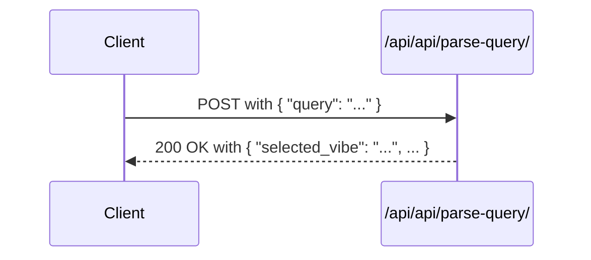
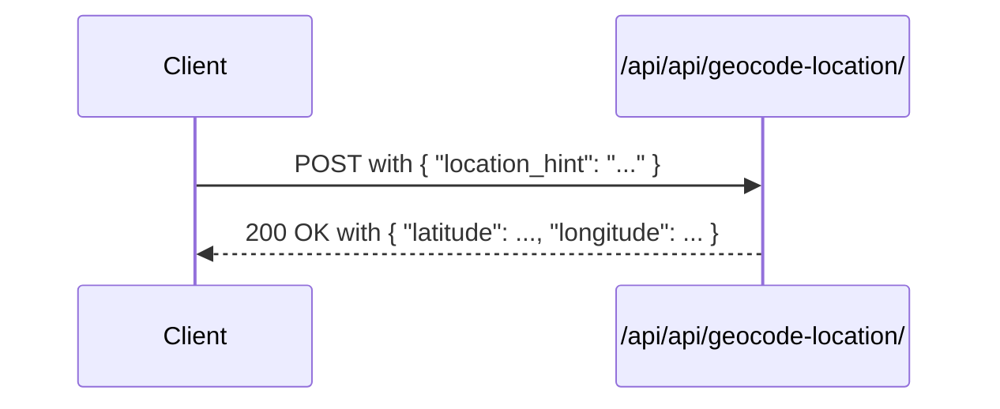
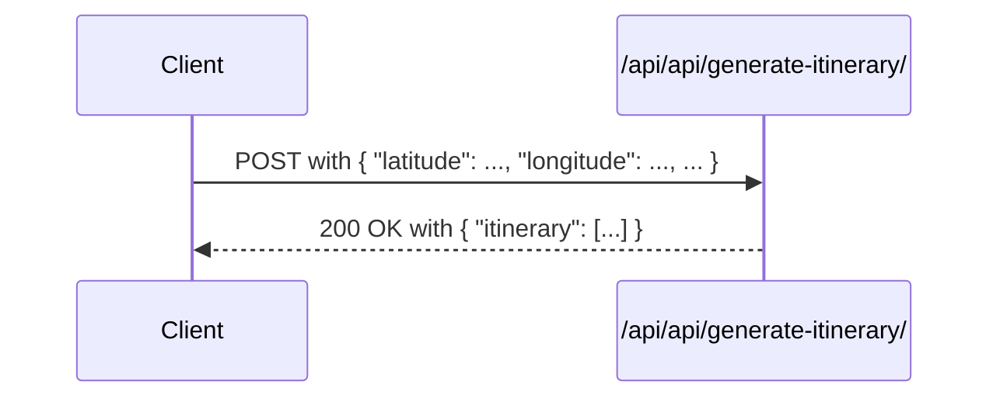
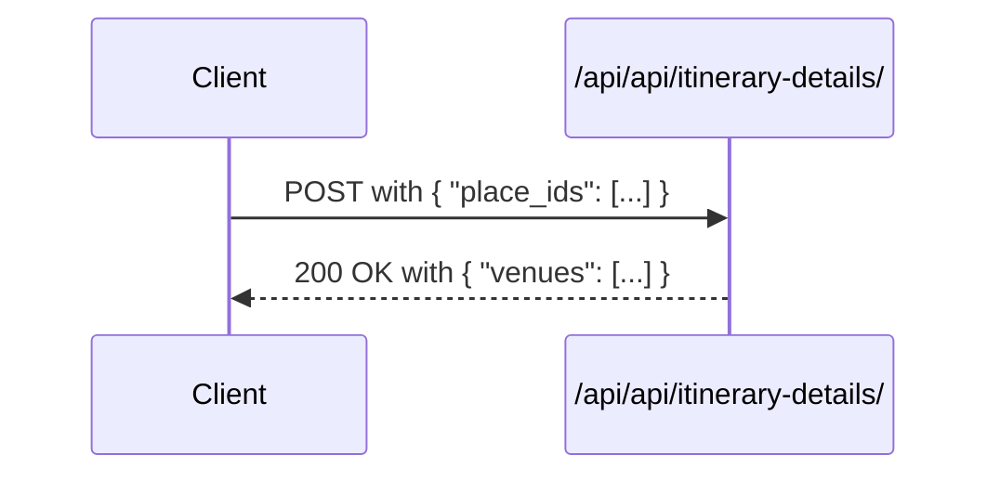
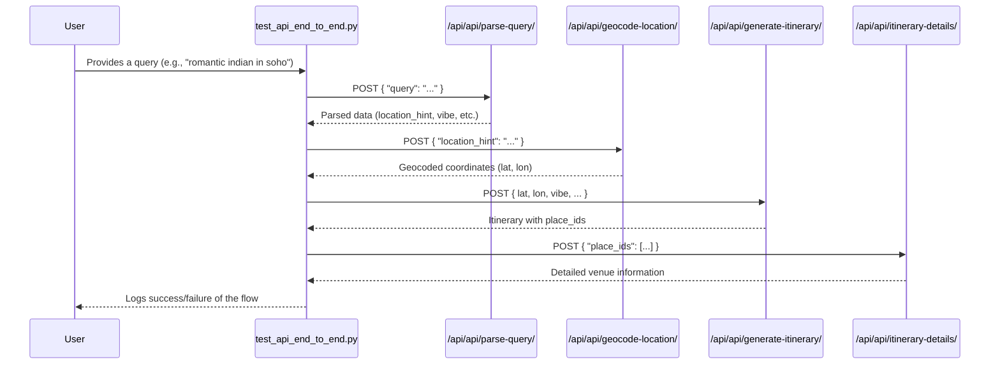

### 🛑 ATTENTION: Developer Guidance for API Changes

The API endpoints documented in this file (`/parse-query`, `/geocode-location`, `/generate-itinerary`, and `/itinerary-details`) do not operate in isolation. They form a **highly interconnected, chained sequence** that models a complete user journey.

A modification to the request payload or response structure of any single endpoint can have **unforeseen chain reactions**, causing failures in downstream endpoints that depend on that data.

**Before making any changes to these endpoints, you MUST:**

1.  **Consult the Flow Diagrams:** Review the "Chained E2E Flow" diagram in this document to understand the full data lifecycle.
2.  **Analyze the End-to-End Test:** Carefully study the `run_chained_flow_for_query` function within the `test_api_end_to_end.py` script. This is the ground truth for how these endpoints are expected to interact.
3.  **Run the Full Test Suite:** After your changes, you must run `test_api_end_to_end.py` to ensure the entire chain remains functional. A passing individual test is not enough.

Failure to consider the entire flow before making changes is likely to break the core itinerary generation feature.

---

# Architecture of `test_api_end_to_end.py`

## Overview

This Python script is an end-to-end test suite for the core API endpoints of an itinerary generation service. It is designed to ensure that the critical user-facing flows are working correctly. The tests are divided into two main categories:

1.  **Pre-flight Tests:** These are isolated tests for each individual API endpoint, verifying basic functionality, input validation, and expected outputs.
2.  **Chained Flows:** These tests simulate a complete user journey by chaining multiple API calls together. It starts with a natural language query from a user and ends with a detailed itinerary.

The script uses a base URL (defaulting to `http://localhost:8000`) which can be overridden by the `BASE_URL` environment variable.

## Flow Diagrams

### Individual Endpoint Flows

These diagrams illustrate the request and response flow for each individual endpoint.

**Parse Query**


**Geocode Location**


**Generate Itinerary**


**Itinerary Details**


### Chained E2E Flow

This diagram shows how the different endpoints are chained together to simulate a full user flow from query to itinerary details.



## Endpoints Tested

### 1. `POST /api/api/parse-query/`

*   **Description:** This endpoint takes a natural language query from a user and parses it to extract structured information that can be used by other services. This includes identifying the desired vibe, cuisine preferences, social context, and location hints.
*   **AI Model Details:**
    *   **Provider:** OpenRouter
    *   **Model:** `xiaomi/mimo-v2-flash:free` (by default)
*   **Input:**
    ```json
    {
      "query": "romantic indian places in soho"
    }
    ```
*   **Output:**
    ```json
    {
      "selected_vibe": "dinner_date",
      "cuisine_preferences": ["indian_north", "indian_south"],
      "social_context": "couple",
      "location_hint": "soho",
      "time_preference": null
    }
    ```
*   **Test Cases:**
    *   `test_parse_query_maps_fields`: Verifies that the endpoint correctly parses a query and returns the expected fields (`selected_vibe`, `cuisine_preferences`, `social_context`, `location_hint`).

### 2. `POST /api/api/geocode-location/`

*   **Description:** This endpoint takes a location hint (e.g., "soho", "downtown") and returns a randomized latitude and longitude within that general area. The randomization is to provide variety in starting points for itinerary generation.
*   **Input:**
    ```json
    {
      "location_hint": "soho"
    }
    ```
*   **Output:**
    ```json
    {
      "latitude": 40.7245,
      "longitude": -74.0018
    }
    ```
*   **Test Cases:**
    *   `test_geocode_returns_valid_coords`: Checks if the endpoint returns valid coordinates that are within the bounds of New York City.
    *   `test_geocode_randomization_varies`: Calls the endpoint twice with the same input and verifies that the returned coordinates are different, confirming that randomization is working.
    *   `test_geocode_requires_hint`: Ensures that the endpoint returns a `400 Bad Request` status code when the `location_hint` is missing from the payload.

### 3. `POST /api/api/generate-itinerary/`

*   **Description:** This is the core endpoint that generates an itinerary based on a set of preferences. It takes a starting location, vibe, social context, cuisine preferences, and other parameters to create a sequence of places to visit.
*   **Input:**
    ```json
    {
      "latitude": 40.707074094216594,
      "longitude": -74.0016461429476,
      "selected_vibe": "dinner_date",
      "social_context": "couple",
      "cuisine_preferences": [
        "indian_north",
        "indian_south"
      ],
      "radius_meters": 3000,
      "local_time_start": "19:00"
    }
    ```
*   **Output:**
    ```json
    {
      "itinerary": [
        {
          "place_id": "ChIJ...",
          "name": "Restaurant Name",
          "latitude": 40.7080,
          "longitude": -74.0020,
          "slot": "19:00 - 20:30",
          "rating": 4.5
        },
        ...
      ]
    }
    ```
*   **Test Cases:**
    *   `test_generate_with_sample_payload`: Verifies that the endpoint can generate an itinerary with a sample payload and that all the generated stops are within the specified radius.

### 4. `POST /api/api/itinerary-details/`

*   **Description:** This endpoint takes a list of `place_id`s and returns detailed information for each place. This is used to enrich the itinerary with more data for the user.
*   **Input:**
    ```json
    {
      "place_ids": ["ChIJ...", "ChIJ..."]
    }
    ```
*   **Output:**
    ```json
    {
      "venues": [
        {
          "place_id": "ChIJ...",
          "name": "Restaurant Name",
          "address": "123 Main St, New York, NY",
          "insights": ["good for dates", "great cocktails"],
          ...
        },
        ...
      ]
    }
    ```
*   **Test Cases:**
    *   `test_itinerary_details_from_generated`: First generates an itinerary, then uses the `place_id`s from the response to call this endpoint and verifies that the details are returned correctly with all the required fields.

## Chained Flow

The `run_chained_flow_for_query` function simulates a real user interaction by chaining the API calls in the following order:

1.  **Parse Query:** It starts with a natural language query (e.g., "romantic indian places in soho").
2.  **Geocode Location:** The `location_hint` from the parsed query is used to get a starting coordinate.
3.  **Generate Itinerary:** The information from the parsed query and the geocoded location is used to generate an itinerary.
4.  **Itinerary Details:** The `place_id`s from the generated itinerary are used to fetch detailed information for each venue.

The script runs this chained flow for a variety of queries to test different scenarios and edge cases, such as missing location information, time preferences, and even nonsensical input. The final summary reports the success rate of both the pre-flight tests and the chained flows.